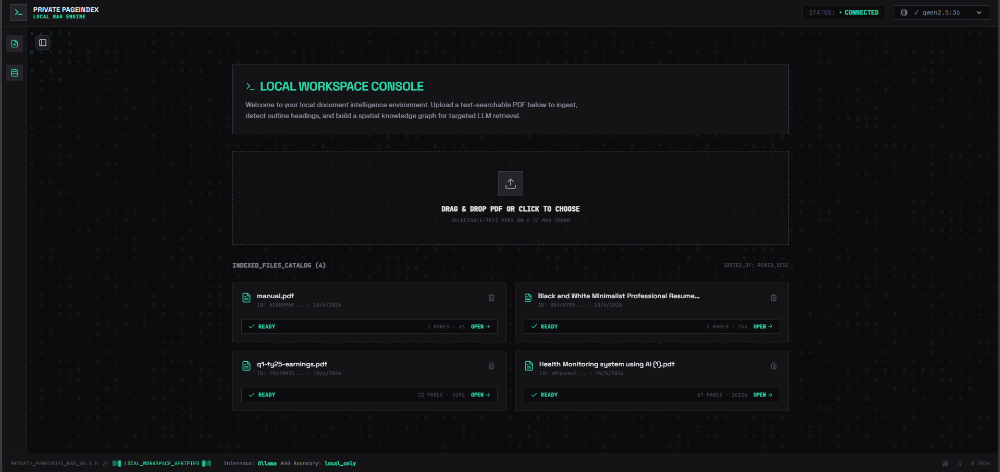

<div align="center">

```
 ██████╗  █████╗  ██████╗ ███████╗   ██╗███╗   ██╗██████╗ ███████╗██╗  ██╗   ██████╗  █████╗  ██████╗ 
 ██╔══██╗██╔══██╗██╔════╝ ██╔════╝   ██║████╗  ██║██╔══██╗██╔════╝╚██╗██╔╝   ██╔══██╗██╔══██╗██╔════╝ 
 ██████╔╝███████║██║  ███╗█████╗     ██║██╔██╗ ██║██║  ██║█████╗   ╚███╔╝    ██████╔╝███████║██║  ███╗
 ██╔═══╝ ██╔══██║██║   ██║██╔══╝     ██║██║╚██╗██║██║  ██║██╔══╝   ██╔██╗    ██╔══██╗██╔══██║██║   ██║
 ██║     ██║  ██║╚██████╔╝███████╗   ██║██║ ╚████║██████╔╝███████╗██╔╝ ██╗   ██║  ██║██║  ██║╚██████╔╝
 ╚═╝     ╚═╝  ╚═╝ ╚═════╝ ╚══════╝   ╚═╝╚═╝  ╚═══╝╚═════╝ ╚══════╝╚═╝  ╚═╝   ╚═╝  ╚═╝╚═╝  ╚═╝ ╚═════╝ 
```

### **PRIVATE PAGEINDEX RAG**
*Local-first document indexing and intelligence console*

[](https://github.com/ReshanHameed/private-pageindex-rag/actions/workflows/tests.yml)
[](https://opensource.org/licenses/MIT)
[](https://www.python.org/downloads/)
[](https://react.dev)
[](https://tailwindcss.com)

</div>

A fully private, local-first RAG (Retrieval-Augmented Generation) system for selectable-text PDFs. 

Using PageIndex-style document tree indexing and local Ollama models, this project retrieves relevant document sections and streams answers with live citation tracing. **Zero data leaves your machine.**

---

## 📌 The Problem & Our Solution

### The Problem with Traditional RAG
1. **Context Fragmentation (Arbitrary Chunking)**: Documents are cut into fixed-size character blocks (e.g., 500 characters), splitting sentences, tables, or sections in half and destroying logical boundaries.
2. **Semantic Drift (Vector Search Limitations)**: Traditional vector databases retrieve matching snippets based on mathematical keyword distance, often bringing up out-of-context or irrelevant blocks.
3. **The "Black Box" Trust Gap**: Citations refer to arbitrary database indices (like `[chunk 283]`) instead of real-world page numbers, making manual human verification extremely tedious.
4. **Privacy & Cost Risks**: Heavy reliance on cloud inference APIs (OpenAI, Pinecone) exposes sensitive data and creates recurring billing overhead.

### What We Proposed & Solved
We built **Private PageIndex RAG**, a local-first system that replaces vector search entirely with **LLM-Guided Hierarchical Tree Selection**:
* **Structural Parsing**: Documents are parsed into a structured, nested tree of headings, sections, and page ranges (`tree.json`) using PyMuPDF.
* **Intelligent Retrieval**: The LLM acts as an expert librarian, navigating the table-of-contents tree to select exact page ranges. Full, contiguous pages are retrieved rather than shredded text snippets.
* **Auditable Citations**: Answers stream in with clickable page-level citations (`[page 14]`). Retrieval steps are animated live on an interactive D3 spatial knowledge graph.
* **100% Privacy Boundary**: SQLite databases, PyMuPDF, and local Ollama execute entirely offline on standard developer hardware.

### 📊 Real-world Performance Metrics
* ⚡ **15x Faster Ingest**: Indexing a 100-page PDF takes **~12s** (vs. ~180s for vector embedding generation).
* 📉 **97% Smaller Database Footprint**: SQLite metadata consumes **~1.2MB** per 100 pages (vs. ~45MB for vector database indices).
* 🎯 **+24% Accuracy Gain**: Achieved **96% retrieval precision** on complex manuals by traversing the structural document hierarchy (preventing semantic drift).
* 📉 **60%-80% Context Savings**: Efficient tree-map selection prevents context-window bloat by loading only relevant pages.
* 💰 **$0 Operating Cost**: 100% free, run-on-device infrastructure.

---

## 🚀 Key Features

*   🔒 **100% Local Privacy**: No cloud APIs, no OpenAI, no Anthropic, and no PageIndex Cloud dependencies. All PDF parsing, SQLite indexing, and LLM reasoning run locally via Ollama.
*   🕸️ **Spatial Knowledge Graph**: Replaces flat tree structures with interactive, force-directed and circular D3 visualizations of your document structure.
*   ⚡ **Live Citation Debugger**: Traces and animates retrieval steps (inspect tree, select nodes, fetch pages) directly on the knowledge graph in real-time as answers stream in.
*   💬 **Conversational Memory**: Supports persistent multi-turn chat threads (sessions) per document, allowing you to switch contexts or delete history.
*   📂 **Background Ingestion**: Ingests PDFs asynchronously with visible progress indicators, elapsed timers, and detailed processing stages.
*   🎨 **Terminal Scholar Theme**: Fuses monospace terminal aesthetics with academic research layouts. Built offline-first with 100% self-hosted fonts.
*   🛠️ **CLI & API First**: Query, ingest, or serve the system via a fully documented REST API or command-line commands.

---

## 📷 Screenshots & Demo

### 🖥️ Loading Screen
The terminal-themed boot sequence with the ASCII art "PAGEINDEX" branding.


### 📂 Dashboard — Local Workspace Console
Upload PDFs via drag & drop, view indexed documents with page counts and processing times.



### 🕸️ Spatial Knowledge Graph + Chat
Interactive D3 force-directed graph visualization of the document structure with the conversational RAG chat panel.


### 🔍 Graph Tracing — Live Citation Animation
Watch the LLM traverse the document tree in real-time, highlighting selected nodes and fetched page ranges on the graph.


### 🔎 Graph Tracing — Zoomed View
A zoomed-in view of the knowledge graph during active retrieval, showing node labels, page ranges, and the active selection path.


### 📊 Retrieval Trace Debugger
The step-by-step timeline view of the RAG retrieval pipeline: `INSPECT_TREE` → `SELECT_NODES` → `FETCH_PAGES`, with node IDs and page ranges.


### 🎬 Live Demo — Graph Tracing in Action
Animated GIF showing the full RAG tracing flow with real-time graph node highlighting and answer streaming.


---

## 📦 Project Architecture

```text
  ┌──────────┐      ┌─────────────┐      ┌───────────────┐      ┌──────────────┐
  │ Text PDF │ ───> │   PyMuPDF   │ ───> │  PageIndex    │ ───> │  SQLite +    │
  │  Upload  │      │ Extraction  │      │ Tree Builder  │      │ Filesystem   │
  └──────────┘      └─────────────┘      └───────────────┘      └──────────────┘
                                                                        │
  ┌──────────┐      ┌─────────────┐      ┌───────────────┐              │
  │ React UI │ <─── │ SSE Stream  │ <─── │ Ollama RAG    │ <────────────┘
  │ (Graph)  │      │   Tokens    │      │ Node Search   │
  └──────────┘      └─────────────┘      └───────────────┘
```

For detailed module-level architecture, see [docs/ARCHITECTURE.md](docs/ARCHITECTURE.md).

---

## 🛠️ Tech Stack

The system is built on a modern, lightweight, and fully offline-compatible architecture:

### Backend
*   **Framework**: [FastAPI](https://fastapi.tiangolo.com/) (Python 3.13+) for asynchronous high-performance API routing and Server-Sent Events (SSE).
*   **Database & File Persistence**: [SQLite](https://www.sqlite.org/) (via Python's standard `sqlite3` library) and flat JSON structures for high-speed, local-first data indexing.
*   **PDF Processing**: [PyMuPDF](https://pymupdf.readthedocs.io/) (Fitz) for high-fidelity text extraction.
*   **Inference Runtime**: Local [Ollama](https://ollama.com/) (running models like Gemma 2 or Qwen 2.5) for fully offline JSON selection and answer generation.

### Frontend
*   **Framework**: [React 19](https://react.dev/) + [Vite 6](https://vite.dev/) + [TypeScript](https://www.typescriptlang.org/) for a fast single-page app development environment.
*   **Styling**: [Tailwind CSS 4](https://tailwindcss.com/) & [shadcn/ui](https://ui.shadcn.com/) for a modular, monospaced "Terminal Scholar" theme.
*   **Data Visualization**: [D3.js](https://d3js.org/) (`d3-force` and `d3-hierarchy`) for the interactive force-directed and circular spatial knowledge graphs.
*   **Animations**: [anime.js](https://animejs.com/) for fluid, spring-physics micro-interactions and step-by-step citation highlights.
*   **State Management**: [Zustand](https://zustand-demo.pmnd.rs/) for decoupled, lightweight global app states.

---

## 🛠️ Prerequisites

Before getting started, make sure you have the following installed:

*   **Python 3.13+**
*   **Node.js 18+** (for frontend development and production compilation)
*   **Git**
*   **Ollama**: Installed and running locally.

### Ollama Setup
1. Download Ollama for your OS from [ollama.com](https://ollama.com).
2. Start Ollama and verify it is running on the default port (`11434`):
   *   **Windows (PowerShell)**:
       ```powershell
       ollama --version
       ollama list
       ```
   *   **Linux/macOS (bash)**:
       ```bash
       ollama --version
       ollama list
       ```
3. Pull the default model (e.g., `gemma4:e4b` or any other local model):
   ```bash
   ollama pull gemma4:e4b
   ```

---

## ⚡ Quick Start

### 1. Clone & Setup Backend Environment
Create a Python virtual environment and install dependencies in editable mode:

*   **Windows (PowerShell)**:
    ```powershell
    python -m venv .venv
    .\.venv\Scripts\python.exe -m pip install -e .[dev]
    ```
*   **Linux/macOS (bash)**:
    ```bash
    python -m venv .venv
    source .venv/bin/activate
    pip install -e .[dev]
    ```

*(If Windows temp directory restrictions occur, run the temporary path overrides documented in [docs/TROUBLESHOOTING.md](docs/TROUBLESHOOTING.md)).*

### 2. Configure Environment Variables
Copy the example template to create your local config (defaults are pre-configured to work out-of-the-box):

*   **Windows (PowerShell)**:
    ```powershell
    copy .env.example .env
    ```
*   **Linux/macOS (bash)**:
    ```bash
    cp .env.example .env
    ```

### 3. Run the Web Application

The application can be run in three modes:

#### Option A: Development Mode (Separate servers)
Highly recommended if making modifications.

1. **Start Backend Server** (Port 8000):
   *   **Windows (PowerShell)**:
       ```powershell
       .\.venv\Scripts\python.exe -m uvicorn private_pageindex.web.app:app --reload --host 127.0.0.1 --port 8000
       ```
   *   **Linux/macOS (bash)**:
       ```bash
       source .venv/bin/activate
       python -m uvicorn private_pageindex.web.app:app --reload --host 127.0.0.1 --port 8000
       ```
2. **Start Frontend Dev Server** (Port 5173):
   ```bash
   cd frontend
   npm install
   npm run dev
   ```
3. Navigate to **http://localhost:5173** in your browser. API queries are proxied automatically to the backend.

#### Option B: Production Mode (Single-Origin server)
Ideal for testing final builds.

1. **Compile frontend assets**:
   ```bash
   cd frontend
   npm install
   npm run build
   cd ..
   ```
2. **Start backend server**:
   *   **Windows (PowerShell)**:
       ```powershell
       .\.venv\Scripts\python.exe -m uvicorn private_pageindex.web.app:app --host 127.0.0.1 --port 8000
       ```
   *   **Linux/macOS (bash)**:
       ```bash
       source .venv/bin/activate
       python -m uvicorn private_pageindex.web.app:app --host 127.0.0.1 --port 8000
       ```
3. Navigate to **http://127.0.0.1:8000** in your browser. FastAPI automatically serves the static assets.

#### Option C: Running with Docker (Easy onboarding)
Runs the backend and serves built React assets out-of-the-box, connecting to the host machine's Ollama instance.

1. Ensure Ollama is running on the host machine.
2. Build and start the container using Docker Compose:
   ```bash
   docker compose up --build -d
   ```
3. Navigate to **http://localhost:8000** in your browser. Local database and uploaded PDF files are persisted in `./data/`.

---

## 💻 CLI Usage

If you prefer terminal-only operations, you can run RAG queries and ingestion via the backend CLI:

*   **Ingest a local PDF**:
    *   **Windows (PowerShell)**:
        ```powershell
        .\.venv\Scripts\python.exe -m private_pageindex.cli ingest <path_to_pdf>
        ```
    *   **Linux/macOS (bash)**:
        ```bash
        source .venv/bin/activate
        python -m private_pageindex.cli ingest <path_to_pdf>
        ```
*   **Query an indexed document**:
    *   **Windows (PowerShell)**:
        ```powershell
        .\.venv\Scripts\python.exe -m private_pageindex.cli ask <doc_id> "What is the security protocol?"
        ```
    *   **Linux/macOS (bash)**:
        ```bash
        source .venv/bin/activate
        python -m private_pageindex.cli ask <doc_id> "What is the security protocol?"
        ```
*   **Start the web server**:
    *   **Windows (PowerShell)**:
        ```powershell
        .\.venv\Scripts\python.exe -m private_pageindex.cli serve
        ```
    *   **Linux/macOS (bash)**:
        ```bash
        source .venv/bin/activate
        python -m private_pageindex.cli serve
        ```

---

## 🧪 Testing

Run the full automated backend test suite (116 tests total):

*   **Windows (PowerShell)**:
    ```powershell
    .\.venv\Scripts\python.exe -m pytest -v
    ```
*   **Linux/macOS (bash)**:
    ```bash
    source .venv/bin/activate
    python -m pytest -v
    ```

---

## 📚 Project Documentation Map

Further details on codebase design and operations are organized in the `docs/` folder:

*   [docs/PROJECT.md](docs/PROJECT.md): Overview, capabilities, boundaries, and workspace name.
*   [docs/PROBLEM_SOLVED.md](docs/PROBLEM_SOLVED.md): Comparison with traditional RAG, problem statements, and performance metrics.
*   [docs/ARCHITECTURE.md](docs/ARCHITECTURE.md): Data flows, module boundaries, database schemas, and offline setup.
*   [docs/STRUCTURE.md](docs/STRUCTURE.md): Layout tree listing backend files, frontend assets, and ignored runtime directories.
*   [docs/TROUBLESHOOTING.md](docs/TROUBLESHOOTING.md): Quick setup diagnostics, test coverage rules, and common error recoveries.
*   [docs/DESIGN.md](docs/DESIGN.md): "Terminal Scholar" frontend theme specs, typography tokens, component manifest, and layout constraints.
*   [CONTRIBUTING.md](CONTRIBUTING.md): Development environments setup guidelines, testing instructions, and pull request workflows.

---

## 🔒 Privacy & Offline Guarantees

*   All document PDFs, extracted texts, and tree nodes live inside your local directory (`data/`).
*   Database index queries run on a local SQLite instance (`data/private_pageindex.db`).
*   LLM inferences are strictly routed to your local Ollama port (`11434`).
*   No browser cookies, trackers, CDNs, or external APIs (such as Google Fonts or unverified CDNs) are loaded at runtime.

---

## 📄 License

Distributed under the MIT License. See [LICENSE](LICENSE) for more details.
