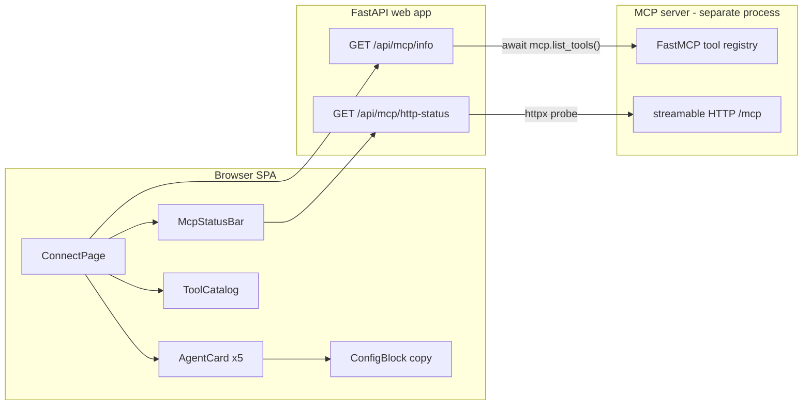

# Design Spec: MCP Connect Screen (Servers & Extensions)

Date: 2026-07-14
Status: Approved design, pending implementation plan
Topic: Frontend "Connect" screen for connecting external agents to the local MCP server

## 1. Purpose

Give users a single in-app screen to connect external AI agents (Claude Desktop, Cursor, Codex, Antigravity IDE, and any manual MCP client) to this project's local MCP server, and to see the live status and the catalog of available MCP tools ("functions").

The MCP server itself already exists (`private_pageindex/mcp_server.py`, added 2026-07-09) and runs as a separate process over stdio or streamable HTTP. This feature is the frontend surface plus a thin read-only backend for it.

## 2. Scope (decided)

- Flavor: Hybrid — a connection hub (per-agent cards) plus a live, read-only status/tools panel.
- Live panel capability: read-only. Shows transport/endpoint/auth config, the tool catalog, and an HTTP reachability probe. No process control.
- Agent cards: Claude Desktop, Cursor, Codex, Antigravity IDE, General/Manual.

### Out of scope (YAGNI, possible follow-ups)

- Inbox file management UI (list/upload/delete PDFs in `data/inbox/`).
- Process control (start/stop the shared HTTP MCP server from the UI).
- Auth-token rotation / editing `.env` from the UI.

## 3. Chosen approach

Thin backend + smart frontend. Two small read-only FastAPI endpoints expose the MCP configuration and tool catalog; the frontend generates all per-agent config snippets client-side from that data.

Rejected alternatives:
- Backend renders ready-made per-agent snippets — more backend churn per agent format; couples backend to client formats.
- Pure static frontend — cannot reflect real tool list, port, auth, or HTTP reachability; fails the hybrid/live goal.

## 4. Architecture



The web app and MCP server share the same codebase and filesystem but run as separate processes. `/api/mcp/info` reads the tool registry by importing the `mcp_server` module in-process (guarded); `/api/mcp/http-status` reaches the MCP server (if running) over HTTP.

## 5. Backend

Both endpoints live in `private_pageindex/web/app.py`, read-only, no side effects.

### 5.1 GET /api/mcp/info

Returns configuration and the tool catalog:

```json
{
  "installed": true,
  "project_root": "D:/Projects/private-pageindex-rag",
  "python_executable": "D:/Projects/private-pageindex-rag/.venv/Scripts/python.exe",
  "stdio": {
    "command": "D:/Projects/private-pageindex-rag/.venv/Scripts/python.exe",
    "args": ["-m", "private_pageindex.cli", "serve-mcp"],
    "cwd": "D:/Projects/private-pageindex-rag"
  },
  "http": {
    "host": "127.0.0.1",
    "port": 8765,
    "url": "http://127.0.0.1:8765/mcp",
    "auth_required": false
  },
  "inbox_dir": "data/inbox",
  "tools": [
    { "name": "ingest_pdf", "description": "..." }
  ]
}
```

- `python_executable` = `sys.executable`; `project_root` = repo root (three parents up from `web/app.py`, as already computed for SPA serving).
- `http.*` from settings (`mcp_http_host`, `mcp_http_port`); `auth_required` = whether `mcp_auth_token` is non-empty. The token value is never returned.
- `tools` read from the live FastMCP registry via `await mcp.list_tools()`.
- The `mcp_server` import is guarded in a `try/except ModuleNotFoundError`; when the optional `mcp` package is absent, return `installed:false` and `tools:[]` so the web app still works.
- Route is `async def` so it can `await mcp.list_tools()`.

### 5.2 GET /api/mcp/http-status

```json
{ "running": true, "url": "http://127.0.0.1:8765/mcp", "detail": "HTTP 406" }
```

- Uses `httpx.AsyncClient` GET to the configured `/mcp` URL with a ~2s timeout.
- Any HTTP response (including 406, which a bare GET to a streamable-HTTP MCP endpoint returns) means `running:true`.
- `httpx.ConnectError` / timeout means `running:false` with a human-readable `detail`.

## 6. Frontend

### 6.1 Route and navigation

- Add `/connect` route to `frontend/src/App.tsx` (lazy-loaded, consistent with existing pages).
- Add a "Connect" sidebar item (a `Plug`/`Cable` lucide icon) in `frontend/src/components/layout/AppShell.tsx`, as a top-level item after a subtle "Integrations" divider.

### 6.2 Page and components (new, under `frontend/src/`)

- `pages/ConnectPage.tsx` — orchestrates fetching and layout.
- `components/connect/McpStatusBar.tsx` — tool count, stdio/HTTP transport summary, `auth: on/off`, live HTTP reachability badge using ASCII status glyphs (`●` reachable / `○` not running) per the design system's ASCII-status convention.
- `components/connect/AgentCard.tsx` — reusable card: icon, title, feature checkmarks, and action buttons.
- `components/connect/ConfigBlock.tsx` — monospace code block with a copy-to-clipboard button.
- `components/connect/ToolCatalog.tsx` — list of MCP tools with name + description.

### 6.3 Layout (mirrors the reference screenshot, Terminal Scholar theme)

1. Header: title + short subtitle ("Use Private PageIndex RAG with your preferred AI agent").
2. Status bar (`McpStatusBar`).
3. Agent cards grid (responsive; 2 columns on wide screens, 1 on narrow).
4. Tools/Functions catalog (`ToolCatalog`).

### 6.4 Per-agent config generation (client-side, from `/api/mcp/info`)

- Claude Desktop: JSON for `claude_desktop_config.json` under `mcpServers.private-pageindex-rag` = `{ command, args, cwd }`. Action: Copy config.
- Cursor: same JSON shape for `.cursor/mcp.json`, plus a one-click "Add to Cursor" deeplink `cursor://anysphere.cursor-deeplink/mcp/install?name=private-pageindex-rag&config=<base64(config)>`.
- Codex: TOML for `~/.codex/config.toml` (`[mcp_servers.private-pageindex-rag]` with `command`, `args`, `cwd`). Action: Copy config.
- Antigravity IDE: shared HTTP endpoint URL (`http.url`) plus a copyable client config; note that the shared HTTP server must be started (`serve-mcp --http`).
- General/Manual: raw stdio command and HTTP command, plus a link to the README MCP section.

### 6.5 Data layer

- `frontend/src/lib/api.ts`: add `getMcpInfo()` and `getMcpHttpStatus()`.
- `frontend/src/lib/types.ts`: add `McpInfo`, `McpTool`, `McpTransportStdio`, `McpTransportHttp`, `McpHttpStatus`.
- State: local `useState`/`useEffect` in `ConnectPage` (no new Zustand store), consistent with `TracePage`. `http-status` refreshed on mount and on a light interval (e.g. every ~10s) while the page is open.

## 7. Styling / design-system compliance

- Use existing Terminal Scholar tokens (`bg-surface`, `bg-interactive`, `border-dim`, `border-default`, `accent`, `text-primary/secondary/tertiary`, `font-display`, `font-mono`).
- ASCII status indicators (`●`/`○`), no `border-radius` status dots.
- No side-stripe accent borders (banned in `docs/DESIGN.md`).
- Copy buttons and cards follow existing button/card component patterns.

## 8. Testing / verification

- Backend: add tests to `tests/test_web_app.py`:
  - `/api/mcp/info` returns transport fields and a non-empty `tools` list (mcp installed in the dev env).
  - `/api/mcp/http-status` returns `running:false` when the endpoint is unreachable (mock `httpx`) and `running:true` on any HTTP response.
- Frontend: `npm run lint`, `npx tsc --noEmit`, `npm run build` (project's standard frontend checks; no JS test runner).

## 9. Invariants preserved

- Read-only: no process control, no `.env` writes, no token exposure.
- Privacy boundary unchanged: endpoints only read local settings and the local tool registry; the HTTP probe targets the local MCP endpoint only.
- Additive only: new route, new components, two new read-only endpoints. No changes to existing routes, CLI, or tree JSON contracts.
- `mcp` remains an optional dependency; the web app degrades gracefully when it is not installed.
